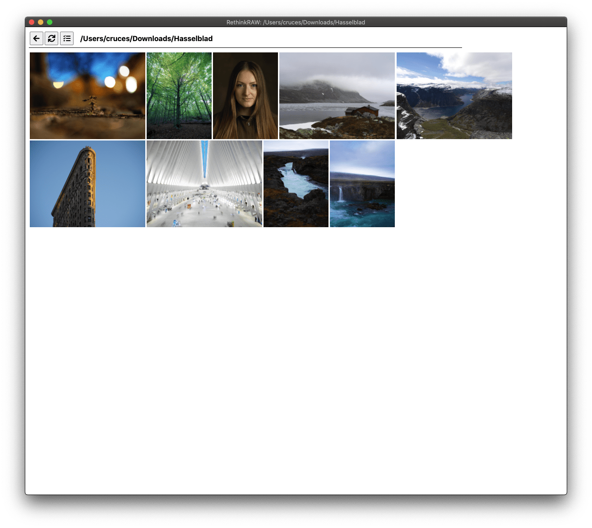
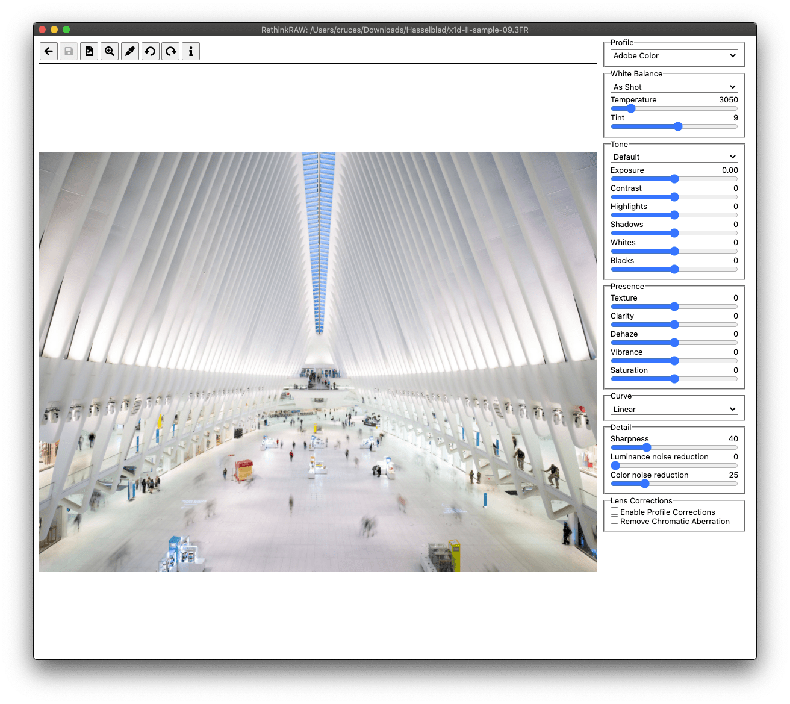

# RethinkRAW 

RethinkRAW is an unpretentious, free RAW photo editor.

## Install

On Windows using [Scoop](https://scoop.sh/) 🍨:

    scoop install https://ncruces.github.io/scoop/RethinkRAW.json

On macOS using [Homebrew](https://brew.sh/) 🍺:

    brew install ncruces/tap/rethinkraw

Or download the [latest release](https://github.com/ncruces/RethinkRAW/releases/latest).

## Build

Download and unpack the [latest source code](https://github.com/ncruces/RethinkRAW/releases/latest)
and run:
- [`./make.cmd`](https://github.com/ncruces/RethinkRAW/blob/master/make.cmd) (on Windows)
- [`./make.sh`](https://github.com/ncruces/RethinkRAW/blob/master/make.sh) (on macOS) or
- [`./make_wine.sh`](https://github.com/ncruces/RethinkRAW/blob/master/make_wine.sh) (elsewhere)

## Features

RethinkRAW works like a simplified, standalone version of Camera Raw.
You can edit your photos without first importing them into a catalog,
and it doesn't require Photoshop.
Yet, it integrates nicely into an Adobe workflow.

You get all the basic, familiar knobs,
and your edits are loaded from, and saved to,
Adobe compatible XMP sidecars and DNGs.
This means you can later move on to Adobe tools,
without losing any of your edits.

To achieve this, RethinkRAW leverages the free
[Adobe DNG Converter](https://helpx.adobe.com/photoshop/using/adobe-dng-converter.html).

## Server mode

RethinkRAW can act like a server that you can access remotely.

On Windows run:

    [PATH_TO]\RethinkRAW.com --password [SECRET] [DIRECTORY]

On macOS run:

    /Applications/RethinkRAW.app/Contents/Resources/rethinkraw-server --password [SECRET] [DIRECTORY]

Elsewhere run:

    [PATH_TO]/rethinkraw-server --password [SECRET] [DIRECTORY]

You can edit photos in `DIRECTORY` by visiting:
- http://local.app.rethinkraw.com:39639 (on the same computer) or
- http://127.0.0.1:39639 (replacing ***127.0.0.1*** by your IP address)

## Screenshots

#### Browsing photos

#### Editing a photo

