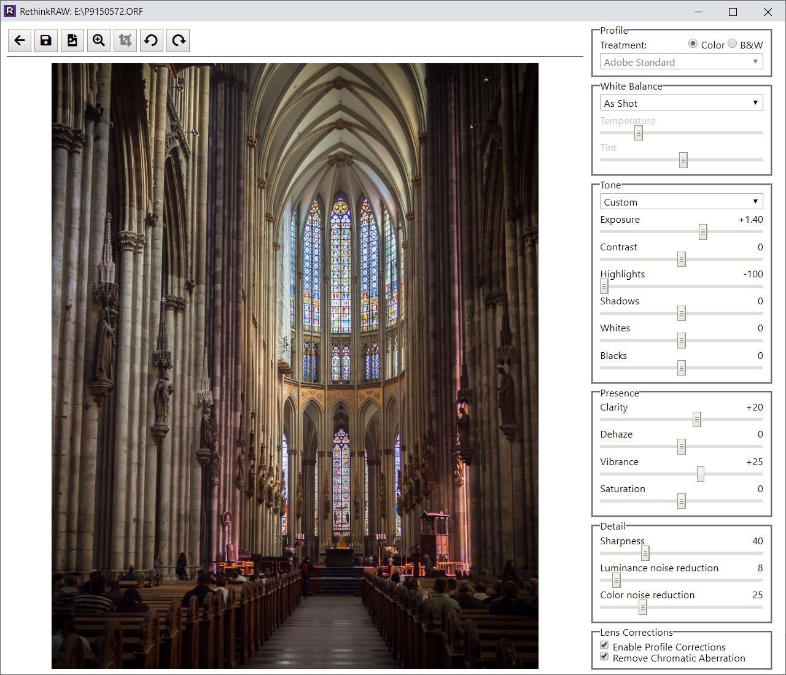

# RethinkRAW

RethinkRAW is a RAW photo editor for people who gave up RAW.

## Download

[Download](https://github.com/ncruces/RethinkRAW/releases/latest) the latest release.

## License

While in beta, RethinkRAW is provided **free of charge** for **personal**, **non-commercial** use.

See [LICENSE.md](LICENSE.md).

## Features

RethinkRAW aims to work like a simplified, standalone version of Camera Raw:
- unlike Lightroom, you don't need to import your photos into a catalog;
- unlike Camera Raw, you don't need Photoshop for it to work; and,
- like both, it integrates nicely into an Adobe workflow.  

You get the familiar knobs,
and your edits are loaded from, and saved to,
Adobe compatible XMP sidecars and DNGs.

To achieve this, RethinkRAW leverages the free [Adobe DNG Converter](https://helpx.adobe.com/photoshop/digital-negative.html).

## Screenshots

#### Browsing photos

#### Editing a photo

