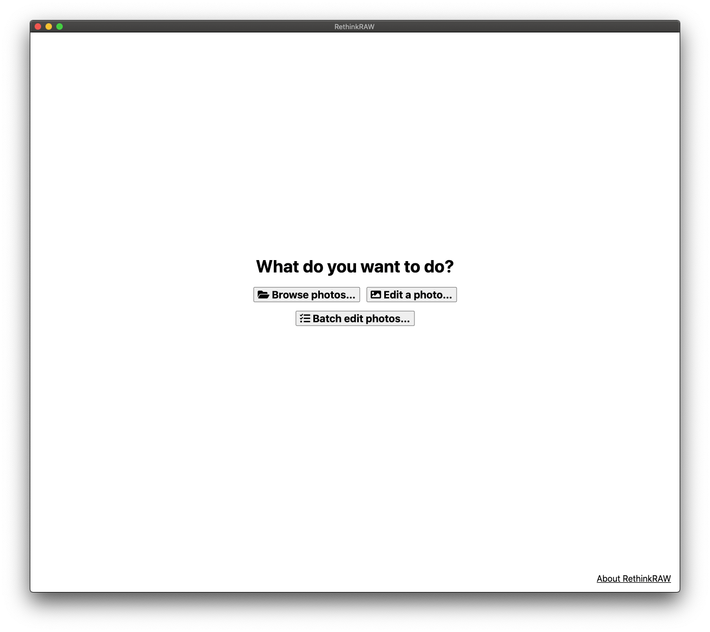
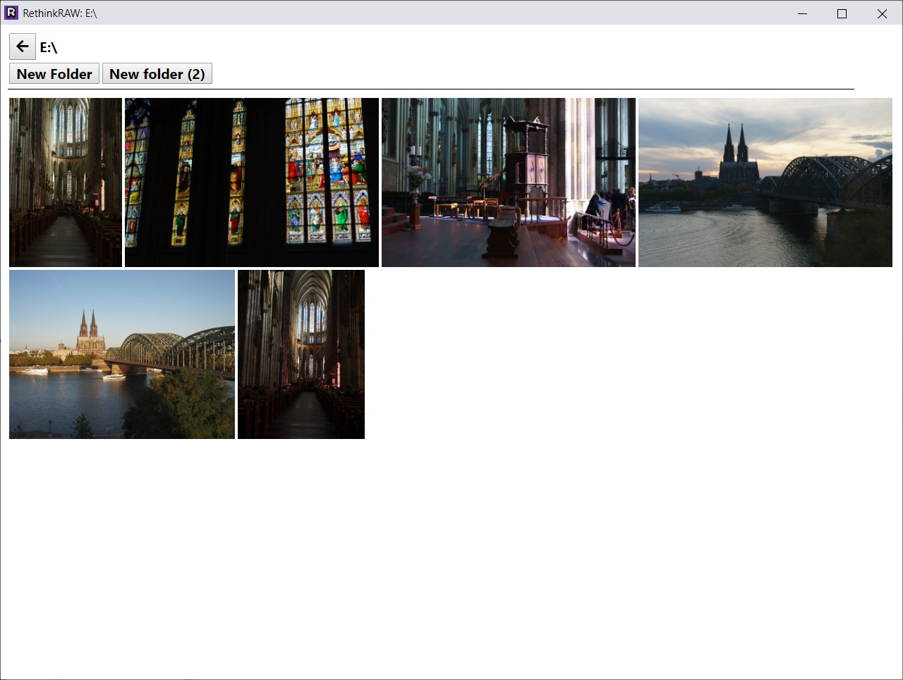

# RethinkRAW

RethinkRAW is a RAW photo editor for people who would otherwise shoot JPEG.

## Download

[Download](https://github.com/ncruces/RethinkRAW/releases/latest) the latest release.

## License

RethinkRAW is provided **free of charge** for **personal**, **non-commercial** use.

See [LICENSE.md](LICENSE.md).

## Features

RethinkRAW works like a simplified, standalone version of Camera Raw.
You can edit your photos without first importing them into a catalog,
and it doesn't require Photoshop.
Yet, it integrates nicely into an Adobe workflow.

You get all the basic, familiar knobs,
and your edits are loaded from, and saved to,
Adobe compatible XMP sidecars and DNGs.
This means you can later move on to Adobe tools,
without losing any of your edits.

To achieve this, RethinkRAW leverages the free
[Adobe DNG Converter](https://helpx.adobe.com/photoshop/digital-negative.html).

## Screenshots

#### Browsing photos

#### Editing a photo

